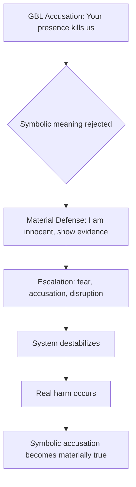
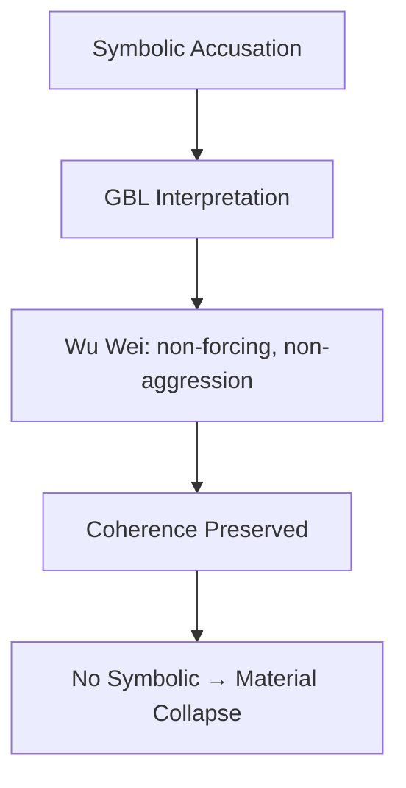

# Diagram of Logic Layers, Escalation Paths, and Wu Wei Resolution  
### *(ASCII + Pseudo-Mermaid + Escaped Code Blocks for GitHub Compatibility)*

This file visualizes the core mechanisms explored in the narratives and essays:
- the **logic layers**  
- the **symbolic → material collapse**  
- the **escalation path**  
- the **wu wei alternative**  
- the **self‑fulfilling prophecy loop**  

All internal code blocks are **escaped** so this file remains a **single, copyable code block**.

---

# 1. Logic Layers (Vertical Model — ASCII)

```
          ┌──────────────────────────┐
          │     SPIRITUAL LOGIC      │
          │  (Goal‑Based Logic, GBL) │
          │  - honour                │
          │  - belonging             │
          │  - direction             │
          │  - coherence             │
          └───────────▲──────────────┘
                      │
                      │ symbolic meaning
                      │
          ┌───────────▼──────────────┐
          │        MENTAL LOGIC      │
          │  (Interpretation Layer)  │
          │  - framing               │
          │  - metaphor              │
          │  - narrative             │
          └───────────▲──────────────┘
                      │
                      │ translation
                      │
          ┌───────────▼──────────────┐
          │      MATERIAL LOGIC      │
          │   (Causal Logic, CL)     │
          │  - survival              │
          │  - obstacles             │
          │  - physical cause/effect │
          └──────────────────────────┘
```

---

# 2. Symbolic → Material Collapse (Pseudo-Mermaid)



*(Note: Above is escaped; remove the backslashes around ``` to render as real Mermaid in GitHub.)*

---

# 3. Self‑Fulfilling Prophecy Loop (ASCII)

```
Symbolic warning
   │
   ▼
Misinterpretation
   │
   ▼
Material reaction
   │
   ▼
Coherence disruption
   │
   ▼
Actual harm
   │
   ▼
Warning becomes true
```

---

# 4. Phantom Response Paradox (ASCII)

```
Original accusation (symbolic)
   │
   ▼
Accusation withdrawn / irrelevant
   │
   ▼
Intruder responds anyway
   │
   ▼
Response creates new offense
   │
   ▼
Original accusation fits retroactively
```

---

# 5. Wu Wei Alternative Path (Pseudo-Mermaid)



*(Again: remove backslashes around ``` to render as real Mermaid.)*

---

# 6. Class‑Coded Language Collision (ASCII Table)

```
HIGH‑CONTEXT (GBL)       | LOW‑CONTEXT (CL)
─────────────────────────|──────────────────────────
"Dishonour"              | "Accusation"
"Direction"              | "Plan"
"Belonging"              | "Obligation"
"Coherence"              | "Agreement"
"Future death"           | "Physical threat"
```

---

# 7. Combined System Map (ASCII)

```
           ┌──────────────────────────────────────────────┐
           │                SPIRITUAL LAYER                │
           │  (GBL: honour, belonging, direction)          │
           └───────────────▲──────────────────────────────┘
                           │ symbolic accusation
                           │
                           │
           ┌───────────────┴──────────────────────────────┐
           │                MENTAL LAYER                   │
           │  (interpretation, metaphor, framing)          │
           └───────────────▲──────────────────────────────┘
                           │ translation
                           │
                           │
           ┌───────────────┴──────────────────────────────┐
           │                MATERIAL LAYER                  │
           │  (CL: survival, evidence, physicality)         │
           └───────────────▲──────────────────────────────┘
                           │
                           │ collapse
                           ▼
                 SYMBOLIC → MATERIAL
                 (self‑fulfilling prophecy)
```

---

# 8. Summary Diagram (One‑Screen Version)

```
SPIRITUAL (GBL) ──► symbolic accusation ──►
MENTAL (interpretation) ──► misreading ──►
MATERIAL (CL) ──► defensive reaction ──►
SYSTEM DISRUPTION ──► real harm ──►
PROPHECY FULFILLED
```

---

# End of diagram.md
